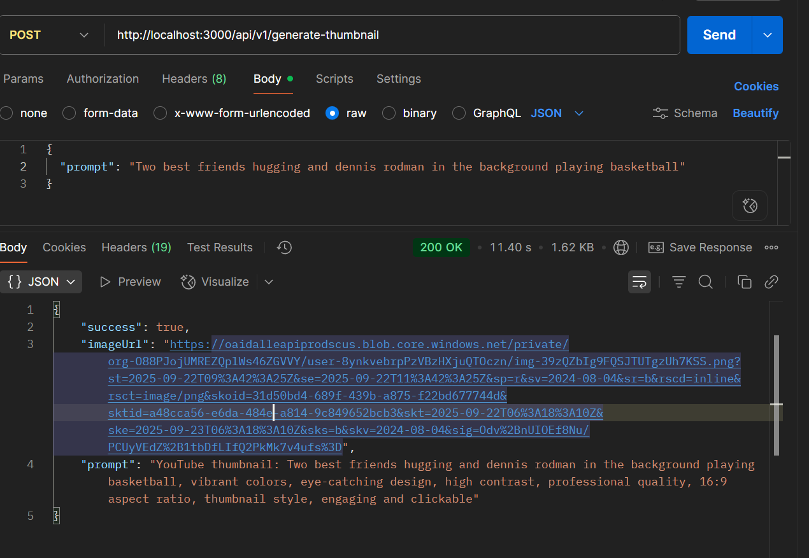

# AI Thumbnail Generator

AI-powered YouTube thumbnail generator that creates engaging thumbnails using OpenAI's DALL-E API. The application generates custom thumbnails based on video topics with relevant imagery and optional text overlays.

## Features

- Express.js REST API with TypeScript
- OpenAI DALL-E API integration for image generation
- Topic-based thumbnail generation
- Input validation with express-validator
- Custom error handling
- CORS and security middleware (helmet)

## Installation and Usage

1. Clone the repository
2. Install dependencies: `npm install`
3. Copy `.env.sample` -> `.env` and set OPENAI_API_URL
4. Start development server: `npm run dev`
5. API is available at `http://localhost:3000`

## API Endpoints

### POST /api/v1/generate-thumbnail

Generate a YouTube thumbnail image based on a text prompt.

**Input:**

```json
{
  "prompt": "space exploration with astronauts and planets"
}
```

**Response:**

```json
{
  "success": true,
  "imageUrl": "https://example.com/generated-image.png",
  "prompt": "YouTube thumbnail: space exploration with astronauts and planets, vibrant colors, eye-catching design, high contrast, professional quality, 16:9 aspect ratio, thumbnail style, engaging and clickable"
}
```

## Image Generation

### How it works

The application uses OpenAI's DALL-E API to generate custom YouTube thumbnails:

1. Takes a text prompt as input describing what you want in the thumbnail
2. Enhances the prompt with YouTube thumbnail-specific styling instructions
3. Sends the request to DALL-E for image generation
4. Returns the generated image URL and enhanced prompt

### Screenshots

#### API Testing with Postman


_Example API request using Postman to generate a thumbnail_

#### Generated Thumbnail Example


_AI-generated YouTube thumbnail created by the API_

### Example Prompts and Results

- **"space exploration with rockets and stars"** - Generates cosmic imagery with spacecraft and celestial bodies
- **"cooking pasta with fresh ingredients"** - Creates food photography with vibrant ingredients and kitchen elements
- **"gaming setup with RGB lighting"** - Produces gaming-themed imagery with colorful lighting and equipment
- **"travel destination tropical beach sunset"** - Shows scenic travel imagery with beaches and sunsets

## Technical Implementation

### Code Structure

- `src/app.ts` - Express.js application configuration
- `src/api/controllers/imageController.ts` - AI image generation handling
- `src/api/routes/imageRoute.ts` - Image generation endpoint
- `src/lib/fetchData.ts` - HTTP request utility function
- `src/middlewares.ts` - Error handling and validation

### AI Integration

The application uses the `fetchData` function to make POST requests to OpenAI's DALL-E API:

```typescript
const request = {
  prompt: `YouTube thumbnail about ${topic} ${
    text ? `with text '${text}'` : ''
  } in bold, eye-catching style`,
  n: 1,
  size: '1024x1024',
  response_format: 'url',
};
```

## Development

- `npm run dev` - Start development server
- `npm run build` - Build TypeScript to JavaScript
- `npm run lint` - Run ESLint

## License

MIT License
